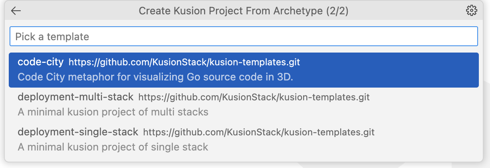
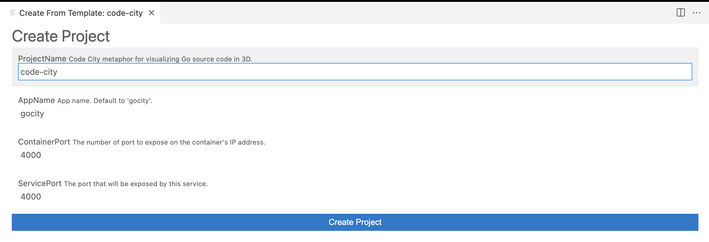
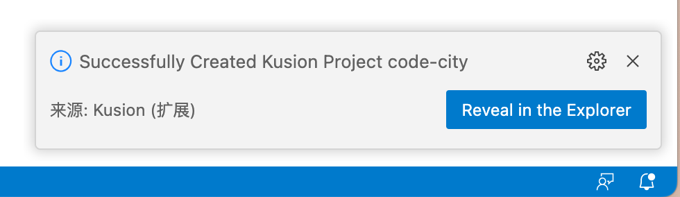

## Create a Kusion Project From Archetype

1. Choose a template to generate a Kusion Project

  

2. Fill in the Basic Information of the Project

  

3. Save the project to the Konfig

  Click the `Create Project` button and choose a folder to save the project.

4. Reveal the Configurations

  Click the `Reveal in the Explorer` button to explore your configuration files. after successfully created the project.

  